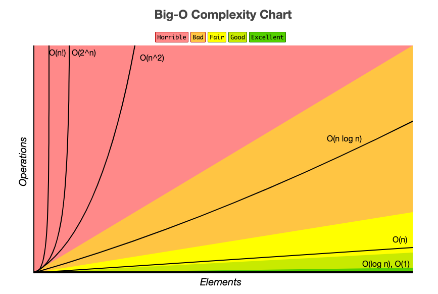
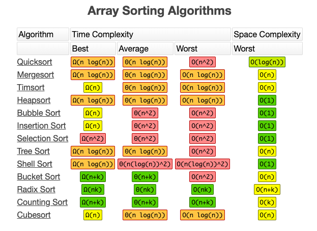

# C++ Fundamentals

## Table of Contents

### [Algorithms](cpp/algorithms)
  * [Sorting](cpp/algorithms/sorting)
  
  * [Searching](cpp/algorithms/searching)


### [Data Structures](cpp/data-structures)
  * [Arrays and Strings](cpp/data-structures/1-arrays-and-strings)

  * [Linked Lists](cpp/data-structures/2-linked-lists)

  * [Stacks and Queues](cpp/data-structures/3-stacks-and-queues)

  * [Graphs](cpp/data-structures/4-graphs)
  
  * [Bit Manipulation](cpp/data-structures/5-bit-manipulation)

  * [Classes](cpp/data-structures/6-classes)

<hr/>

## Asymptotic Analysis

## Time Complexity
For the sake of simplicity, we shall only consider Big-O notation, which is the convention in practice. We can describe the Big-O runtime of an algorithm in 3 different ways. Let's take a look at quicksort as an example:

Quicksort chooses a random element as a "pivot" and then swaps values in the array such that elements less than the pivot come before elements greater than the pivot. This gives us a "partial sort". Then it recursively sorts the left and right subarrays using a similar process.

 - **Best Case**: 
   - If all elements are equal, then quicksort will, on average, traverse through the array only one. This requires **O(N)** time.

 - **Worst Case**:
   - What if we get very unlucky and the pivot is repeatedly the largest element in the array? (Actually, this can easily happen. If the pivot is chosen to be the first element in the subarray and the array is sorted in reverse order, then we'll have this situation). In this case, our recursion doesn't divide the array in half and recurse on each half. It just shrinks our array by one element on each iteration, requiring **O(N^2)** time.

 - **Expected Case**:
   - Typically, these wonderful (or terrible) situations will not occur. Sure, sometimes our pivot may be very low or high, but usually won't happen over and over again. We can expect a runtime of **O(N log N)**.

### Drop the Constants:
It is very possible for <i>O(N)</i> code to run faster than <i>O(1)</i> code for specific inputs. Big-O simply describes the rate of increase. For this reason, we drop constants when describing runtimes. An algorithm that one might describe as <i>O(2N)</i> is actually <i>O(N)</i>.

### Drop the Non-Dominant Terms:
What do we do in the case of a runtime like `O(N^2 + N)`? The second `N` isn't exactly a constant, but it's not especially important. We already discussed dropping constants, therefore `O(N^2 + N^2)` would actually just be `O(N^2)`. If we don't care about the second `N^2` term, then why would we care about `N`? We don't. 

You should drop the non-dominant terms:
- O(N^2 + N) becomes O(N^2)
- O(N + log N) becomes O(N)
- O(5 * 2^N + 1000N^100) becomes O(2^N)

We can still have a sum in a rumtime, however. For example, the expression O(B^2 + A) cannot be reduced (without some special knowledge of A and B).

### Multi-part Algorithms: Add vs. Multiply
Suppose we have an algorithm that has two (or more) steps. When do you multiply the runtimes and when do you add them?

#### Add the Runtimes: O(A + B)
```
  1. for(int a : arrA)
  2.    print(a)
  3.
  4. for(int b : arrB)
  5.    print(b)
```
In this example, we do `A` chunks of work, then `B` chunks of work. Therefore, our total amount of work is **O(A + B)**

#### Multiply the Runtimes: O(A * B)
```
  1. for(int a : arrA)
  2.    for(int b : arrB)
  3.       print(a + ',' + b);
```
In this example, we do `B` chunks of work for each element in `A`. Therefore the total amount of work is **O(A * B)**

In other words:
- If the algorithm takes the form "do this, then, when you're finished, do that", then you add the runtimes.
- If the algorithm takes the form "do this for each time you do that", then you multiply the runtimes.

### Amortized Runtimes
An `ArrayList` (or `vector`) is a dynamically resizable array. This offers the benefits of an array while providing flexible size. You won't run out of space with an `ArrayList` since its capacity grows as elements get added.

An `ArrayList` is implemented using an array. When the array hits capacity, the `ArrayList` class will create a new array with double the capacity and copy all the elements into the new array.

How then, do you describe the runtime of inserting elements? This is a tricky question.

The array could be full. If the array contains `N` elements, then adding a new element will take `O(N)` time. You will have to crate a new array of size `2N` and copy all `N` elements over, which will require **O(N)** time. 

<i>However</i>, we know that this doesn't happen very often. The vary majority of the time, insertions will only require **O(1)** time. 

We need some concept that takes both of these scenarios into account, which is exactly what amortized analysis does. It allows us to describe that, yes, this worst case occurs every once in a while; but, once it happens, it won't happen again for so long, that the cost is "amortized".

So, what is the amortized runtime complexity in this case?

As we add elements, we double the capacity when the size of the array is a power of 2. So, after `X` elements are inserted, we double the array capacity at sizes 1, 2, 4, 8, 16, ..., X. That double takes, respectively, 1,2, 4, 16, 32, 64, ..., X copies.

What is the sum of 1 + 2 + 4 + 8 + 16 + ... + X? If you read this sum left to right, it begins with 1 and doubles until we reach X. If you read it right to left, then it begins with X and halves until it reaches 1.

What then is the sum of X + X/2 + X/4 + X/8 + ... + 1? This is roughly `2X`.

Therefore, `X` insertions take `O(X)` time, and the **amortized** time required is **O(1)**.

### Log(N) Runtimes
We commonly use `O(log N)` runtimes, but where does this arise from?

Consider binary search as an example. In binary search, we look for an element `x` in an `N`-element, sorted array. We first compare `x` to the midpoint of the array. If `x == middle`, then we return. If `x < middle`, then we search on the left side of the array. If `x > middle`, then we search on the right side of the array.

```
   search 9 within { 1, 5, 8, 9, 11, 13, 15, 19, 21 }
     compare 9 with 11 -> smaller
     search 9 within { 1, 5, 8, 9 }
       compare 9 with 8 -> bigger
       search 9 within { 9 }
         compare 9 with 9 
         return
```
We stare with an `N`-element array to search through. Then, after a single step, we've decreased the problem space by N/2 elements. One more step, and we're down to N/4 elements. We stop when we either find the target value or we're down to a single element.

The total runtime is a matter of how many steps (dividing by 2 at each step) we take until `N` becomes 1. 
- N = 16
- N = 8    /* Divide by 2 */
- N = 4    /* Divide by 2 */
- N = 2    /* Divide by 2 */
- N = 1    /* Divide by 2 */

We could look at this in reverse (going from 1 to 16). I.e., how many times can we multiply 1 by 2 until we reach `N`?
- N = 1
- N = 2    /* Multiply by 2 */
- N = 4    /* Multiply by 2 */
- N = 8    /* Multiply by 2 */
- N = 16    /* Multiply by 2 */

So, what is `k` in the expression  ? This is exactly what `log` expresses.
>   -->  
> 
>   -->  

When you see a problem where the number of elements in the problem space gets halved each time, it will likely be a `O(log N)` runtime. This is also why finding an element in a balanced binary tree takes `O(log N)` time. With each comparison, we go either left or right. Hald the nodes are on each side, so we cut the problem space in half each time.

### Recursive Runtimes
What is the runtime of this code?

```
  1.  int f(int n){
  2.    if(n <= 1)
  3.      return 1;
  4.    return f(n - 1) + f(n - 1);
```

Many people see the 2 calls to `f` and assume `O(N^2)`. This is completely incorrect. 

Rather than making assumptions, let's derive the runtime by walking through the code. Suppose we call `f(4)`. This calls `f(3)` twice. Each of those calls to `f(3)` calls `f(2)`, until we get down to `f(1)`. 

```
                                          __f(4)__
                                         /         \
                                       /             \
                                    f(3)             f(3)
                                  /     \           /     \
                                 /       \         /       \
                                f(2)    f(2)      f(2)     f(2)
                               /   \    /   \     /   \    /   \
                           f(1)  f(1) f(1) f(1)  f(1)  f(1) f(1) f(1)
```

How many calls are in this tree? (Don't count!)

The tree will have depth `N`. Each node (i.e., function call) has 2 children. Therefore, each level will have twice as many calls as the previous level. The number of nodes at each level is:
<table style="width:100%">
  <tr>
    <th>N</th>
    <th>Level</th>
    <th># Nodes</th>
    <th>Also Expressed as...</th>
   <th>Or...</th>
  </tr>
  <tr>
    <td>4</td>
    <td>0</td>
    <td>1</td>
    <td></td>
    <td></td>
  </tr>
  <tr>
    <td>3</td>
    <td>1</td>
    <td>2</td>
    <td>2 * previous level = 2</td>
    <td></td>
  </tr>
   <tr>
    <td>2</td>
    <td>2</td>
    <td>4</td>
    <td>2 * previous level = 2 * </td>
    <td></td>
  </tr>
   <tr>
    <td>1</td>
    <td>3</td>
    <td>8</td>
    <td>2 * previous level = 2 * </td>
    <td></td>
  </tr>
</table>

More generally, this can be expressed as 2^0 + 2^1 + 2^2 + 2^3 + 2^4 + ... + 2^(n-1).

When a recursive function makes multiple calls, the runtime will often (but not always), look like **O(`branches`^`depth`)**, where `branches` is the number of times each recursive call branches. In this case, this gives us **O(2^N)**

> You may recall that the base of a log does not matter for big-O runtimes, since logs of different bases are only different by a constant factor. However, this does NOT apply for exponentials. The base of an exponent <i>does</i> matter. Compare  and . If you expand , you get , which equals , which equals . As you can see,  and  are different by a factor of . That is very much not a constant factor!

The space complexity of this algorithm is **O(N)**. Although we have **O()** total nodes in the tree, only **O(N)** exist on the call stack at any given time. Therefore, we only need **O(N)** memory available.


<hr/>

## Space Complexity
Time is not our only consideration when designing algorithms. We are also concerned with how much memory is required by an algorithm. Spatial asymptotic analysis is parallel with runtime analysis. I.e., if we need to create an array of size `n`, then this will require **O(N)** space. Similarly, a 2D array of size `n` by `n` will require **O(N^2)** space. 

Stack space for recursive function calls is another consideration in spatial complexity analysis. For example, the following code would take both **O(N)** time and **O(N)** space.

```
  1.  int sum(int n){
  2.     if(n <= 0)
  3.         return 0;
  4.     return n + sum(n-1);
  5.  }
```
Each function call adds one level to the call stack:
```
  1.  sum(4)
  2.   -> sum(3)
  3.     -> sum(2)
  4.        -> sum(1)
  5.           -> sum(0)
```
<i>However</i>, just because you have `n` calls in total, does not mean that it requires `O(N)` space. Consider the following example, which adds adjacent elements between 0 and `n`.

```
  1.  int pairSumSequence(int n){
  2.    int sum = 0;
  3.    for(int i = 0; i < n; i++)
  4.       sum += pairSum(i, i+1);
  5.    return sum;
  6.  }
  7.
  8.  int pairSum(int a, int b){
  9.    return a + b;
  10. }
```
There will be roughly <i>O(N)</i> calls to `pairSum()`. However, these calls do not exist simultaneously on the call stack. Therefore, we only need **O(1)** space.




<hr/>
