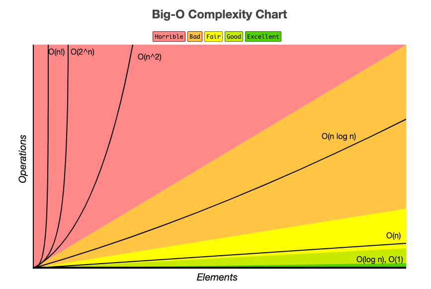
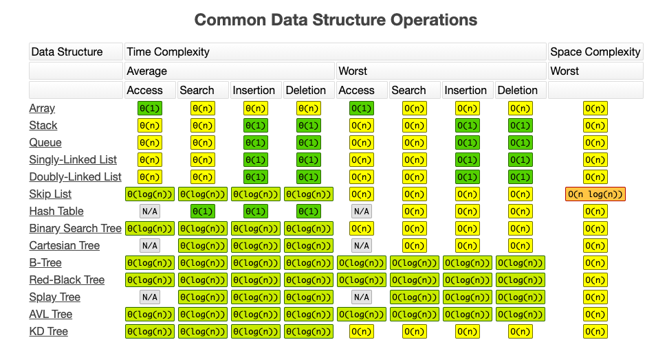
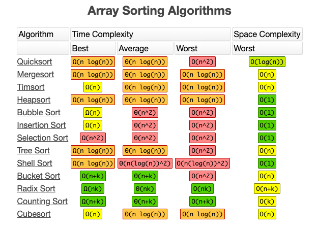

# C++ Fundamentals

## Table of Contents

### [Algorithms](algorithms)
  * [Sorting](algorithms/sorting)
  
  * [Searching](algorithms/searching)

### [Data Structures](data-structures)
  * [Arrays and Strings](data-structures/1-arrays-and-strings)

  * [Linked Lists](2-linked-lists)

  * [Stacks and Queues](data-structures/3-stacks-and-queues)

  * [Graphs](data-structures/4-graphs)
  
  * [Bit Manipulation](data-structures/5-bit-manipulation)

  * [Classes](data-structures/6-classes)

## Asymptotic Analysis

### Time Complexity

### Space Complexity
