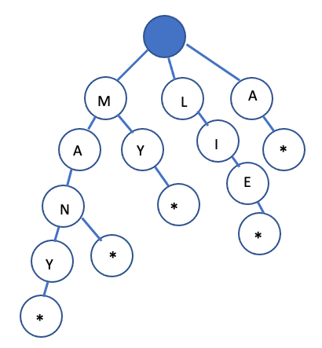
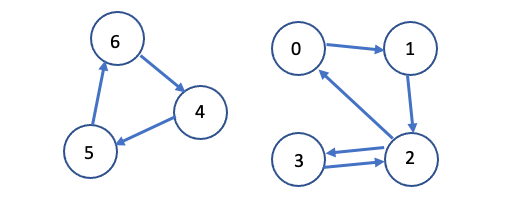
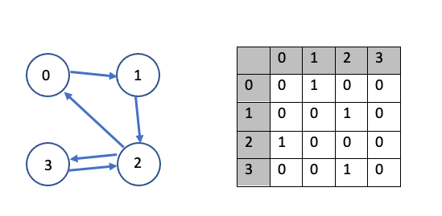
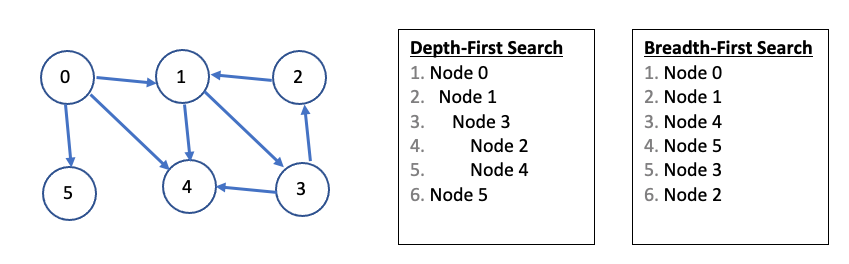

# [Data Structures](../)

## Trees and Graphs (C++)

### Types of Trees
A tree is a data structure composed of nodes.
  - Each tree has a root node. (Actually, this isn't strictly necessary in graph theory, but is typically how we use trees in programming).
  - The root node has zero or more child nodes.
  - Each child node has zero or mode child nodes, and so on.

The tree cannot contain cycles. The nodes may or may not be in a particular order, they could have any data types as values, and they may or may not have links back to their parent nodes.

A simple class definition for a Node:
  > ```
  > class Node{
  >   public:
  >     string name;
  >     Node[] children;
  > }

### Trees vs. Binary Trees:
A binary tree is a tree in which each node has up to two children. Not all trees are binary trees. For example, this tree is not a binary tree. You could call it a ternary tree:


There are occasions where you might have a tree that is not a bianry tree. For example, suppose you were using a tree to represent a bunch of phone numbers. In this case, you might use a 10-ary tree, with each node having up to 10 children (1 for each digit).

A node is called a `leaf` if it has no children.

### Binary Tree vs. Binary Search Tree:
A binary search tree is a binary tree in which every node follows a specific ordering: 
  - `all left descendants <= n <= all right descendants`
  - This must be true for every node `n`

<p float="left">
  
  
</p>

### Balanced vs. Unbalanced

#### Complete Binary Trees:
A complete binary tree is a binary tree in which every level of the tree is fully filled, except for perhaps the last level. To the extent that the last level is filled, it is filled from left to right:

<p float="left">
  
  
</p>

#### Full Binary Trees:
A full binary tree is a binary tree in which every node has either zero or two children. That is, no nodes have only one child.

<p float="left">
  
  
</p>

#### Perfect Binary Trees:
A perfect binary tree is one where all interior nodes have two children and all leaf nodes are at the same level. Visually, this looks like the diagram below (although of course it may be larger or smaller).


<hr/>

### Binary Tree Traversal

#### In-Order Traversal
In-order traversal means to "visit" the left branch, then the current node, then the right branch:
  > ```
  > void inOrder(TreeNode node){
  >   if(node != NULL){
  >     inOrder(node.left);
  >     visit(node);
  >     inOrder(node.right);
  >   }
  > }
When performed on a binary search tree, it visits the nodes in ascending order (hence the name, "in-order")

#### Pre-Order Traversal
Pre-Order Traversal visits the current node before its child nodes (hence the name, "pre-order")
  > ```
  > void preOrder(TreeNode node){
  >   if(node != NULL){
  >     visit(node);
  >     preOrder(node.left);
  >     preOrder(node.right);
  >   }
  > }
In a pre-order traversal, the root node is always the first node visited.

#### Post-Order Traversal
Post-Order traversal visits the current node after its child nodes (hence the name, "post-order")
  > ```
  > void preOrder(TreeNode node){
  >   if(node != NULL){
  >     preOrder(node.left);
  >     preOrder(node.right);
  >     visit(node);
  >   }
  > }
In a post-order traversal, the root node is always the last node visited.
<hr/>

### Binary Heaps (Max-Heaps and Min-Heaps)
A min-heap is a <i>complete</i> binary tree (that is, totally filled other than the rightmost elements on the last level) where each node is smaller than its children. The root, therefore, is the minimum element in the tree.

>
>            5                      13
>         /      \               /       \  
>       10        15           16         31 
>      /                      /  \        /  \
>     30                    41    51    100   41

### Tries (Prefix Trees)
A trie (sometimes called a prefix tree) is a variant of an n-ary tree in which characters are stored at each node. Each path down the tree might represent a word, for example. The * nodes (sometimes called null nodes) are often used to indicate complete words. The existence of the MA path indicates that there are words that start with MA.

The actual implementation of these * nodes mgith be a special type of child (such as a TerminatingTrieNode, which inherits from TrieNode). Or, we could just use a boolean flag `terminates` within the parent node.



Very commonly, a trie is used to store the entire english language for quick prefix lookups. While a hash table can quickly look up whether a string is a valid word, it cannot tell us if a string is a prefix of any valid words. A trie can do this very quickly.
  > How quickly? A trie can check if a string is a valid prefix in O(K) time, where K is the length of the string. This is actually the same runtime that a hashtable would take. Although we often refer to hash table lookups as being O(1) time, this isn't entirely true. A hash table must read through all the characters in the input, which takes O(K) time in the case of a word lookup.
<hr/>

## Graphs
A tree is actually a type of graph, but not all graphs are trees. Simply put, a tree is a connected graph without any cycles.

A graph is simply a collection of nodes with edges between (some of) them.
  - Graphs can either be directed (like the following) or undirected. While directed edegs are like a one way street, undirected edges are like a two-way street. 
  - The graph might consist of multiple isolated subgraphs. If there exists a path between every pair of vertices, it is called a "connected graph"
  - The graph can also have cycles (or not). An "acyclic graph" is one without cycles.

Visually, you could draw a graph like this:



In terms of programming, there are two common ways to represent a graph:

### Adjacency List:
This is the most common way to represent a graph. Every vertex (or node) stores a list of adjacent vertices. In an undirected graph, an edge like (a, b) would be stored twice: once in a's adjacent vertices and once in b's adjacent vertices.

A simple class definition for a graph node could look essentially the same as a tree node

  > ```
  > class Graph{
  >   public:
  >     Node[] nodes;
  > }
  > 
  > class Node{
  >   public:
  >     string name;
  >     Node[] children;
  > }

The Graph class is used because, unlike in a tree, you can't necessarily reach all the nodes from any single node.

You don't necessarily need any additional classes to represent a graph. An array (or hash table) of lists (arrays, arraylists, linkedlists, etc.) can store the adjacency list. The graph above could be represented as:
  > 0: 1
  > 1: 2
  > 2: 0, 3
  > 3: 2
  > 4: 6
  > 5: 4
  > 6: 5
This is a bit more compact, but isn't quite as clean. We tend to use node classes unless there is a compelling reason not to.

### Adjacency Matrices:
An adjacency matrix is an N x N boolean matrix (where N is the number of nodes), where a `true` value at matrix[i][j] indicates an edge from node i to node j. (You can also use an integer matrix with 0s and 1s).

In an undirected graph, an adjacency matrix will be symmetric.



The same graph algorithms that are used on adjacency lists (bfs, dfs, etc.) can also be performed on adjacency matrices, but they are somewhat less efficient. In the adjacency list representation, you can easily iterate through the neighbors of a node. In the adjacency matrix representation, you will need to iterate through all the nodes to identify the neighbors for one node.
<hr/>

### Graph Search:
The two most common ways to search a graph are depth-first search and breadth-first search.

In depth-first search (DFS), we start at the root (or another arbitratily selected node) and explore each branch completely before moving onto the nexet branch. That is, we go deep first (hence the name, "depth-first"), before we go wide.

In breadth-first search (BFS), we start at the root (or another arbitratily selected node) and explore each neighbor before going onto any of their children. That is, we go wide (hence the name, "breadth-first"), before we go deep.

Below is a depiction of a graph and its depth-first and breadth-first search (assuming neighbors are iterated in numerical order).



Breadth-first search and depth-first search tend to be used in different scenarios. DFS is often preferred if we want to visit every node in the graph. Both will work just fine, but DFS is a bit simpler. 

However, if we want to find the shortest path (or just any path) between two nodes, BFS is generally better. Consider representing all the friendships in the entire world in a graph and trying to find a path of friendships between Ash and Vanessa. 

In DFS, we could take a path like Ash -> Brian -> Carleton -> Davis -> Eric -> Farah -> Gayle -> Harry -> Isabella -> John -> Kari ... and then find ourselves very far away. We could go through most of the world without realizing that, in fact, Vanessa is Ash's friend. We will still eventually find the path, but it may take a long time. It also won't find the shortest path.

In BFS, we would stay as close to Ash for as long as possible. We might iterate through many of Ash's friends, but we wouldn't go to his more distant connections until absolutely necessary. If Vanessa is Ash's friend, or his friend-of-a-friend, then we'll find this out relatively quickly.
