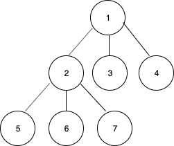
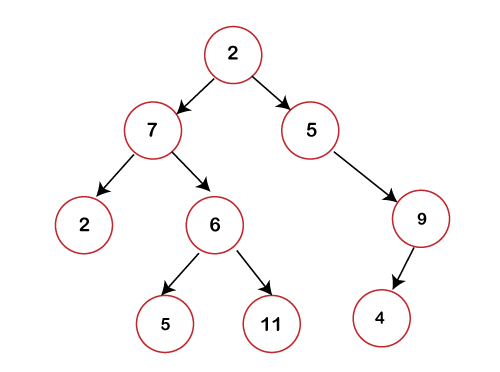
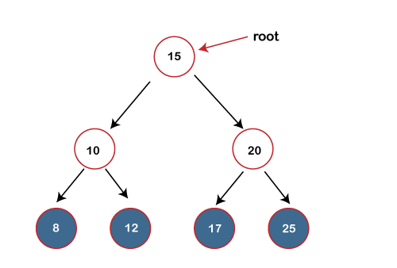
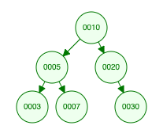
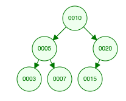
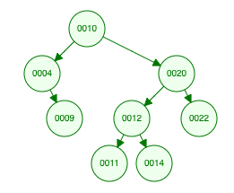
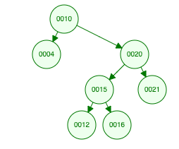
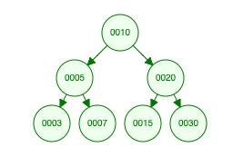

# [Data Structures](../)

## Trees and Graphs (C++)

### Types of Trees
A tree is a data structure composed of nodes.
  - Each tree has a root node. (Actually, this isn't strictly necessary in graph theory, but is typically how we use trees in programming).
  - The root node has zero or more child nodes.
  - Each child node has zero or mode child nodes, and so on.

The tree cannot contain cycles. The nodes may or may not be in a particular order, they could have any data types as values, and they may or may not have links back to their parent nodes.

A simple class definition for a Node:
  > ```
  > class Node{
  >   public:
  >     string name;
  >     Node[] children;
  > }

### Trees vs. Binary Trees:
A binary tree is a tree in which each node has up to two children. Not all trees are binary trees. For example, this tree is not a binary tree. You could call it a ternary tree:



There are occasions where you might have a tree that is not a bianry tree. For example, suppose you were using a tree to represent a bunch of phone numbers. In this case, you might use a 10-ary tree, with each node having up to 10 children (1 for each digit).

A node is called a `leaf` if it has no children.

### Binary Tree vs. Binary Search Tree:
A binary search tree is a binary tree in which every node follows a specific ordering: 
  - `all left descendants <= n <= all right descendants`
  - This must be true for every node `n`

<p float="left">
  
  
</p>

### Balanced vs. Unbalanced

#### Complete Binary Trees:
A complete binary tree is a binary tree in which every level of the tree is fully filled, except for perhaps the last level. To the extent that the last level is filled, it is filled from left to right:

<p float="left">
  
  
</p>

#### Full Binary Trees:
A full binary tree is a binary tree in which every node has either zero or two children. That is, no nodes have only one child.

<p float="left">
  
  
</p>

#### Perfect Binary Trees:
A perfect binary tree is one where all interior nodes have two children and all leaf nodes are at the same level. Visually, this looks like the diagram below (although of course it may be larger or smaller).



<hr/>

### Binary Tree Traversal

#### In-Order Traversal
In-order traversal means to "visit" the left branch, then the current node, then the right branch:
  > ```
  > void inOrder(TreeNode node){
  >   if(node != NULL){
  >     inOrder(node.left);
  >     visit(node);
  >     inOrder(node.right);
  >   }
  > }
When performed on a binary search tree, it visits the nodes in ascending order (hence the name, "in-order")

#### Pre-Order Traversal
Pre-Order Traversal visits the current node before its child nodes (hence the name, "pre-order")
  > ```
  > void preOrder(TreeNode node){
  >   if(node != NULL){
  >     visit(node);
  >     preOrder(node.left);
  >     preOrder(node.right);
  >   }
  > }
In a pre-order traversal, the root node is always the first node visited.

#### Post-Order Traversal
Post-Order traversal visits the current node after its child nodes (hence the name, "post-order")
  > ```
  > void preOrder(TreeNode node){
  >   if(node != NULL){
  >     preOrder(node.left);
  >     preOrder(node.right);
  >     visit(node);
  >   }
  > }
In a post-order traversal, the root node is always the last node visited.
<hr/>

### Binary Heaps (Max-Heaps and Min-Heaps)
A min-heap is a <i>complete</i> binary tree (that is, totally filled other than the rightmost elements on the last level) where each node is smaller than its children. The root, therefore, is the minimum element in the tree.

>
>            5                      13
>         /      \               /       \  
>       10        15           16         31 
>      /                      /  \        /  \
>     30                    41    51    100   41

### Tries (Prefix Trees)
A trie (sometimes called a prefix tree) is a variant of an n-ary tree in which characters are stored at each node. Each path down the tree might represent a word, for example. The * nodes (sometimes called null nodes) are often used to indicate complete words. 
